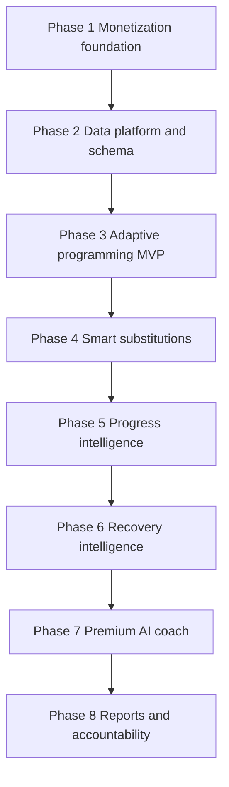

# Paid Feature Monetization Delivery Spec

## Purpose

This document turns the roadmap in [plans/2026-03-27-paid-feature-monetization-roadmap.md](plans/2026-03-27-paid-feature-monetization-roadmap.md) into an implementation-ready delivery plan for the full monetization program.

It is scoped to planning only. It does not change runtime behavior.

## Planning assumptions

- Existing subscription infrastructure is real but currently bypassed by [SundeeFundee/Features/Subscription/SubscriptionManager.swift](SundeeFundee/Features/Subscription/SubscriptionManager.swift) and [SundeeFundee/App/AppState.swift](SundeeFundee/App/AppState.swift).
- Existing single-session AI flow in [SundeeFundee/Features/AIWorkout/AIWorkoutFlowView.swift](SundeeFundee/Features/AIWorkout/AIWorkoutFlowView.swift) must remain intact and gain new branches rather than be rewritten.
- SwiftData migration remains forward-only, so new persistence work must extend [SundeeFundee/App/AppSchemaMigrationPlan.swift](SundeeFundee/App/AppSchemaMigrationPlan.swift) and [SundeeFundee/App/AppModelContainer.swift](SundeeFundee/App/AppModelContainer.swift) together.
- Shared exercise metadata should live in [SundeeFundee/Packages/SundeeFundeeShared/Sources/SundeeFundeeShared/Models/ExerciseCatalog.swift](SundeeFundee/Packages/SundeeFundeeShared/Sources/SundeeFundeeShared/Models/ExerciseCatalog.swift) or sibling shared-package models when both app and dashboard depend on the same taxonomy.
- The first shippable monetization release should bias toward deterministic product value and clear gating before building expensive AI-heavy surfaces.

## Strategic shipping stance

### What should ship first

Ship the smallest release that creates a real paid product and introduces one defensible paid benefit:

1. Restore real entitlement evaluation
2. Finalize the free, plus, and premium matrix
3. Update paywall and subscription management messaging
4. Add monetization analytics events
5. Deliver an MVP adaptive weekly planning domain with one dashboard entry point and one weekly plan screen

This creates an actual conversion funnel and a clear paid reason to upgrade before deeper Premium coaching work begins.

### What should not block first ship

The following should stay out of the first release slice unless they are needed for data compatibility:

- Full symptom intelligence
- Multi-week AI coach memory
- Reports and exports
- Accountability challenges
- Dashboard authoring changes beyond minimum exercise metadata support

## Phase map

## Delivery phases

### Phase 1: Monetization foundation and packaging reset

#### Goal

Re-enable real paid access, align the tier model with the roadmap, and make paid entry points measurable.

#### Epics

##### Epic 1.1: Restore real subscription state

**Concrete outcomes**
- Free users no longer default to Premium access
- StoreKit products load and resolve the highest active tier
- App-level tier state is derived from entitlement state instead of hardcoded defaults

**Primary file-level change areas**
- [SundeeFundee/Features/Subscription/SubscriptionManager.swift](SundeeFundee/Features/Subscription/SubscriptionManager.swift)
- [SundeeFundee/App/AppState.swift](SundeeFundee/App/AppState.swift)
- [SundeeFundee/Domain/Subscription/SubscriptionTier.swift](SundeeFundee/Domain/Subscription/SubscriptionTier.swift)
- [SundeeFundee/Features/Subscription/StoreKitProductLoader.swift](SundeeFundee/Features/Subscription/StoreKitProductLoader.swift)
- [SundeeFundee/Features/Subscription/StoreKitTransactionVerifier.swift](SundeeFundee/Features/Subscription/StoreKitTransactionVerifier.swift)
- [SundeeFundee/Resources/SundeeFundee.storekit](SundeeFundee/Resources/SundeeFundee.storekit)
- [project.yml](project.yml)

**Implementation notes**
- Replace premium defaulting in the subscription manager start path with product loading, transaction listening, and entitlement refresh.
- Stop seeding app state with a premium tier fallback.
- Confirm product IDs in the tier model match StoreKit configuration and App Store Connect.
- Keep the tier source of truth in the subscription manager and propagate it into app state consistently.

##### Epic 1.2: Rebuild entitlement map around packaged value

**Concrete outcomes**
- Free, Plus, and Premium map to the new product promises instead of the current mixed legacy feature set
- All locked experiences route through a defined trigger-to-paywall map

**Primary file-level change areas**
- [SundeeFundee/Domain/Subscription/FeatureEntitlement.swift](SundeeFundee/Domain/Subscription/FeatureEntitlement.swift)
- [SundeeFundee/Domain/Subscription/SubscriptionTier.swift](SundeeFundee/Domain/Subscription/SubscriptionTier.swift)
- [SundeeFundee/Features/Subscription/FeatureGateModifier.swift](SundeeFundee/Features/Subscription/FeatureGateModifier.swift)
- [SundeeFundee/Features/Dashboard/DashboardView.swift](SundeeFundee/Features/Dashboard/DashboardView.swift)
- [SundeeFundee/Features/Benchmarks/BenchmarksView.swift](SundeeFundee/Features/Benchmarks/BenchmarksView.swift)
- [SundeeFundee/Features/Maxes/MaxLiftsView.swift](SundeeFundee/Features/Maxes/MaxLiftsView.swift)
- [SundeeFundee/Features/Settings/SettingsView.swift](SundeeFundee/Features/Settings/SettingsView.swift)
- [SundeeFundee/Features/AIWorkout/WorkoutHistoryView.swift](SundeeFundee/Features/AIWorkout/WorkoutHistoryView.swift)

**Implementation notes**
- Add new gated features for adaptive planning, smart substitutions, readiness insights, symptom intelligence, reports, coach memory, and accountability.
- Separate hard limits from outcome features so the paywall can explain value clearly.
- Produce a route map documenting every lock surface, trigger event, and fallback state.

##### Epic 1.3: Rewrite monetization UX and messaging

**Concrete outcomes**
- Paywall copy sells outcomes instead of raw feature counts
- Subscription management reflects active benefits by tier
- Locked surfaces explain what unlocks at each tier

**Primary file-level change areas**
- [SundeeFundee/Features/Subscription/PaywallView.swift](SundeeFundee/Features/Subscription/PaywallView.swift)
- [SundeeFundee/Features/Subscription/PaywallViewModel.swift](SundeeFundee/Features/Subscription/PaywallViewModel.swift)
- [SundeeFundee/Features/Subscription/ManageSubscriptionView.swift](SundeeFundee/Features/Subscription/ManageSubscriptionView.swift)
- [SundeeFundee/Features/Subscription/PremiumBadge.swift](SundeeFundee/Features/Subscription/PremiumBadge.swift)
- [docs/app-store-copy.md](docs/app-store-copy.md)
- [public/terms.html](public/terms.html)
- [public/privacy.html](public/privacy.html)

**Implementation notes**
- Reframe the paywall around free equals instant AI help, plus equals better workout intelligence, premium equals personal coach that learns you.
- Update comparison tables to match the final entitlement map and remove stale legacy claims.
- Ensure guest users have a clear upgrade path but retain access to free onboarding and core logging.

##### Epic 1.4: Monetization analytics instrumentation

**Concrete outcomes**
- Funnel visibility for exposure, conversion, and feature-triggered upsell
- Stable event taxonomy that later phases reuse

**Primary file-level change areas**
- [SundeeFundee/Observability/MetricsService.swift](SundeeFundee/Observability/MetricsService.swift)
- new analytics abstraction near [SundeeFundee/Observability](SundeeFundee/Observability)
- [SundeeFundee/Features/Subscription/PaywallView.swift](SundeeFundee/Features/Subscription/PaywallView.swift)
- [SundeeFundee/Features/Subscription/ManageSubscriptionView.swift](SundeeFundee/Features/Subscription/ManageSubscriptionView.swift)
- gated entry views across [SundeeFundee/Features](SundeeFundee/Features)

**Implementation notes**
- MetricKit alone is not enough for business events, so add an app analytics service for product telemetry.
- Define events before instrumenting views to prevent taxonomy drift.
- Log trigger source, selected tier, billing period, purchase start, purchase success, restore success, and locked-feature source.

#### Dependencies

- Final tier matrix and StoreKit product mapping must be locked before UX copy and analytics naming are finalized.
- Analytics abstraction should land before broad instrumentation.

#### Primary risks

- Product IDs or StoreKit config may not match the intended launch matrix.
- Current hardcoded premium defaults may have hidden dependencies in gated UI.
- Copy drift between in-app messaging and App Store metadata can cause review and trust issues.

#### Exit criteria

- Free users experience actual locking
- Plus and Premium products resolve correctly
- Every locked route has a paywall trigger reason
- Funnel analytics are visible for key monetization events

---

### Phase 2: Data platform and schema expansion

#### Goal

Introduce the persistence and repository layer needed by later paid features without yet requiring all advanced UX to ship.

#### Epics

##### Epic 2.1: New SwiftData schema version for monetization and coaching data

**Concrete outcomes**
- New models exist for adaptive planning, recovery inputs, coach memory, reports, and accountability
- Existing models gain only the minimum extensions needed for compatibility and analytics

**Primary file-level change areas**
- [SundeeFundee/App/AppSchemaMigrationPlan.swift](SundeeFundee/App/AppSchemaMigrationPlan.swift)
- [SundeeFundee/App/AppModelContainer.swift](SundeeFundee/App/AppModelContainer.swift)
- new schema file under [SundeeFundee/App](SundeeFundee/App)
- [SundeeFundee/Models/User.swift](SundeeFundee/Models/User.swift)
- [SundeeFundee/Models/CompletedWorkout.swift](SundeeFundee/Models/CompletedWorkout.swift)
- [SundeeFundee/Models/PainLog.swift](SundeeFundee/Models/PainLog.swift)
- new models under [SundeeFundee/Models](SundeeFundee/Models)

**Target new persisted models**
- Adaptive plan
- Adaptive plan session
- Recovery check-in
- Symptom trend snapshot or equivalent derived cache
- Exercise preference
- Substitution preference
- AI coach plan
- AI coach memory item
- Weekly insight snapshot
- Accountability goal
- Premium challenge enrollment
- Generated report record

**Likely extensions to existing models**
- User: coaching preferences, equipment defaults, accountability preferences, onboarding consent flags
- Completed workout: adherence status, adaptation outcome flags, richer completion signals
- Pain log or companion symptom data: broader symptom vocabulary
- Generated workout history: saved plan and memory linking metadata

**Implementation notes**
- Use raw-string persistence for any new enums.
- Keep old schema versions in the migration plan and add the new version rather than mutating existing history.
- Favor additive optional fields where possible to reduce migration complexity.

##### Epic 2.2: Repository and service interfaces for future paid systems

**Concrete outcomes**
- New repository contracts isolate adaptive planning, recovery, coach memory, and reports from views
- Domain engines stay testable and mostly deterministic

**Primary file-level change areas**
- [SundeeFundee/Repositories/Protocols/RepositoryProtocols.swift](SundeeFundee/Repositories/Protocols/RepositoryProtocols.swift)
- new repositories under [SundeeFundee/Repositories/SwiftData](SundeeFundee/Repositories/SwiftData)
- new domain services under [SundeeFundee/Domain](SundeeFundee/Domain)
- [SundeeFundee/App/AppState.swift](SundeeFundee/App/AppState.swift)

**Implementation notes**
- Introduce app-private repositories for adaptive plans, recovery check-ins, coach memory, insight snapshots, reports, and accountability goals.
- Keep any repository that holds a model context main-actor isolated.
- Separate persistence from plan-generation logic so engines remain unit-testable.

##### Epic 2.3: Shared package and dashboard contract preparation

**Concrete outcomes**
- Shared exercise taxonomy can support substitutions and future adaptive content authoring
- Dashboard and app can evolve against a common schema

**Primary file-level change areas**
- [SundeeFundee/Packages/SundeeFundeeShared/Sources/SundeeFundeeShared/Models/ExerciseCatalog.swift](SundeeFundee/Packages/SundeeFundeeShared/Sources/SundeeFundeeShared/Models/ExerciseCatalog.swift)
- new shared models under [SundeeFundee/Packages/SundeeFundeeShared/Sources/SundeeFundeeShared/Models](SundeeFundee/Packages/SundeeFundeeShared/Sources/SundeeFundeeShared/Models)
- new shared validators under [SundeeFundee/Packages/SundeeFundeeShared/Sources/SundeeFundeeShared/Validation](SundeeFundee/Packages/SundeeFundeeShared/Sources/SundeeFundeeShared/Validation)
- later dashboard changes in [wod-dashboard](wod-dashboard) if content authoring is adopted

**Implementation notes**
- Add movement pattern, stimulus, equipment class, contraindications, and substitution affinity metadata to the shared package rather than hardcoding it in only the app.
- Treat user preferences and private coaching memory as app-only data, not shared-package content.

#### Dependencies

- Phase 1 tiering must define which capabilities need persistent data.
- Shared taxonomy design should be settled before substitution engine implementation in Phase 4.

#### Primary risks

- Scope explosion from trying to persist every future concept before an MVP uses it.
- Migration mistakes can corrupt local stores or break CloudKit compatibility.
- Shared package changes can create app-dashboard drift if not versioned carefully.

#### Exit criteria

- New schema version exists with migration coverage
- Repository interfaces support later phases without view coupling
- Shared exercise taxonomy supports substitution modeling

---

### Phase 3: Adaptive programming MVP and expansion

#### Goal

Turn the app from single-session generation into week-level adaptive planning, starting with deterministic logic and clear user-visible rationale.

#### Epics

##### Epic 3.1: Adaptive planning domain core

**Concrete outcomes**
- Deterministic weekly planner generates a week of sessions from user state and training history
- Re-planning can occur after missed workouts or symptom changes
- Planner output includes user-facing rationale

**Primary file-level change areas**
- new domain folder under [SundeeFundee/Domain](SundeeFundee/Domain)
- [SundeeFundee/Domain/CycleCalculations.swift](SundeeFundee/Domain/CycleCalculations.swift)
- [SundeeFundee/Domain/CycleAdaptationPolicy.swift](SundeeFundee/Domain/CycleAdaptationPolicy.swift)
- [SundeeFundee/Domain/InjuryAdaptationEngine.swift](SundeeFundee/Domain/InjuryAdaptationEngine.swift)
- [SundeeFundee/Domain/PainTrendAnalyzer.swift](SundeeFundee/Domain/PainTrendAnalyzer.swift)
- [SundeeFundee/Models/CompletedWorkout.swift](SundeeFundee/Models/CompletedWorkout.swift)
- new repositories under [SundeeFundee/Repositories](SundeeFundee/Repositories)

**Proposed new domain types**
- Adaptive training context
- Adaptive week plan
- Adaptive session adjustment
- Adaptive programming engine
- Adaptive programming repository

**Implementation notes**
- Build the planner as a deterministic rules engine first, not an AI feature.
- Inputs should include cycle phase, current program state, adherence, pain trend, perceived effort, equipment, and recent workload.
- Output should include adaptation reasons that UI can render directly.

##### Epic 3.2: MVP adaptive planning UX

**Concrete outcomes**
- Dashboard exposes one adaptive plan entry point
- Users can view a weekly plan screen with explanations for each session
- Locked states upsell Plus without breaking free core flows

**Primary file-level change areas**
- [SundeeFundee/Features/Dashboard/DashboardView.swift](SundeeFundee/Features/Dashboard/DashboardView.swift)
- [SundeeFundee/Features/Dashboard/DashboardViewModel.swift](SundeeFundee/Features/Dashboard/DashboardViewModel.swift)
- new adaptive planning feature folder under [SundeeFundee/Features](SundeeFundee/Features)
- [SundeeFundee/Features/Shell/MainTabView.swift](SundeeFundee/Features/Shell/MainTabView.swift)
- [SundeeFundee/Features/Subscription/FeatureGateModifier.swift](SundeeFundee/Features/Subscription/FeatureGateModifier.swift)

**Implementation notes**
- Keep the MVP focused on one adaptive weekly plan screen and one dashboard card.
- Preserve existing program enrollment and workout execution flows rather than replacing them in the first pass.
- Attach paywall entry events to adaptive-plan CTA surfaces.

##### Epic 3.3: Adaptive re-planning loop

**Concrete outcomes**
- Missed workouts, skips, and pain changes can trigger plan refresh recommendations
- Users can understand why the plan changed

**Primary file-level change areas**
- [SundeeFundee/Features/Dashboard/DashboardView.swift](SundeeFundee/Features/Dashboard/DashboardView.swift)
- [SundeeFundee/Features/Workouts/WorkoutExecutionViewModel.swift](SundeeFundee/Features/Workouts/WorkoutExecutionViewModel.swift)
- [SundeeFundee/Features/Workouts/WorkoutSummaryView.swift](SundeeFundee/Features/Workouts/WorkoutSummaryView.swift)
- [SundeeFundee/Repositories/SwiftData/SwiftDataWorkoutRepository.swift](SundeeFundee/Repositories/SwiftData/SwiftDataWorkoutRepository.swift)
- [SundeeFundee/Repositories/SwiftData/SwiftDataPainLogRepository.swift](SundeeFundee/Repositories/SwiftData/SwiftDataPainLogRepository.swift)

**Implementation notes**
- Use event-driven invalidation markers rather than recalculating the whole plan on every view render.
- Log plan regeneration reasons for product analytics and debugging.

#### Dependencies

- Requires Phase 1 entitlements and Phase 2 schema-repository groundwork.
- Should precede substitutions, since substitutions become an execution detail of the plan.

#### Primary risks

- Overloading current program logic can create contradictory session sources.
- Insufficient adherence data may weaken adaptation quality if schema changes are delayed.
- UI complexity can grow quickly if adaptive plans and standard program flows coexist without clear precedence rules.

#### Exit criteria

- Plus users can generate and view an adaptive week plan
- Re-planning occurs from at least one concrete trigger such as skip or pain spike
- UI surfaces show rationale for changes

---

### Phase 4: Smart substitutions

#### Goal

Let users swap exercises safely and quickly while keeping the session aligned to intended stimulus.

#### Epics

##### Epic 4.1: Shared exercise metadata expansion

**Concrete outcomes**
- Shared taxonomy supports movement pattern, stimulus, equipment compatibility, and contraindication matching

**Primary file-level change areas**
- [SundeeFundee/Packages/SundeeFundeeShared/Sources/SundeeFundeeShared/Models/ExerciseCatalog.swift](SundeeFundee/Packages/SundeeFundeeShared/Sources/SundeeFundeeShared/Models/ExerciseCatalog.swift)
- new shared substitution metadata models under [SundeeFundee/Packages/SundeeFundeeShared/Sources/SundeeFundeeShared/Models](SundeeFundee/Packages/SundeeFundeeShared/Sources/SundeeFundeeShared/Models)
- dashboard-side content support if needed under [wod-dashboard](wod-dashboard)

##### Epic 4.2: Deterministic substitution engine

**Concrete outcomes**
- Users get one-tap substitutions ranked by movement match, equipment fit, and injury-cycle constraints
- Substitution choices include a reason string

**Primary file-level change areas**
- new substitution domain files under [SundeeFundee/Domain](SundeeFundee/Domain)
- [SundeeFundee/Domain/InjuryAdaptationEngine.swift](SundeeFundee/Domain/InjuryAdaptationEngine.swift)
- new repositories for substitution preferences under [SundeeFundee/Repositories](SundeeFundee/Repositories)
- new substitution preference models under [SundeeFundee/Models](SundeeFundee/Models)

##### Epic 4.3: Workout preview and execution integration

**Concrete outcomes**
- Substitution suggestions appear in preview and execution flows
- Users can save substitution preferences for future reuse

**Primary file-level change areas**
- [SundeeFundee/Features/AIWorkout/WorkoutPreviewView.swift](SundeeFundee/Features/AIWorkout/WorkoutPreviewView.swift)
- [SundeeFundee/Features/AIWorkout/WorkoutPreviewViewModel.swift](SundeeFundee/Features/AIWorkout/WorkoutPreviewViewModel.swift)
- [SundeeFundee/Features/Workouts/WorkoutExecutionView.swift](SundeeFundee/Features/Workouts/WorkoutExecutionView.swift)
- [SundeeFundee/Features/Workouts/WorkoutExecutionViewModel.swift](SundeeFundee/Features/Workouts/WorkoutExecutionViewModel.swift)
- [SundeeFundee/Features/Subscription/FeatureGateModifier.swift](SundeeFundee/Features/Subscription/FeatureGateModifier.swift)

#### Dependencies

- Requires shared taxonomy from Phase 2 and likely reuses adaptive planning context from Phase 3.

#### Primary risks

- Taxonomy quality determines substitution quality; weak metadata will feel random.
- If substitution logic is partly content-driven, dashboard authoring can become a hidden dependency.
- Injury restrictions must remain authoritative over user preference shortcuts.

#### Exit criteria

- Plus users can accept at least one recommended substitution in preview or execution
- Saved substitution preferences affect future recommendations
- Swap reason strings are visible to the user

---

### Phase 5: Progress intelligence

#### Goal

Turn workout and benchmark data into actionable readiness and progress insights.

#### Epics

##### Epic 5.1: Deterministic analytics layer

**Concrete outcomes**
- Readiness scoring, plateau detection, PR prediction, and benchmark recommendations exist as pure domain logic

**Primary file-level change areas**
- new analytics domain files under [SundeeFundee/Domain](SundeeFundee/Domain)
- [SundeeFundee/Domain/Calculations](SundeeFundee/Domain/Calculations)
- [SundeeFundee/Domain/PainTrendAnalyzer.swift](SundeeFundee/Domain/PainTrendAnalyzer.swift)
- [SundeeFundee/Models/CompletedWorkout.swift](SundeeFundee/Models/CompletedWorkout.swift)
- [SundeeFundee/Models/Maxes.swift](SundeeFundee/Models/Maxes.swift)
- [SundeeFundee/Models/Benchmark.swift](SundeeFundee/Models/Benchmark.swift)

**Proposed domain types**
- Progress snapshot
- Readiness score
- Plateau signal
- Benchmark readiness recommendation
- Progress intelligence service

##### Epic 5.2: Insight surfacing

**Concrete outcomes**
- Dashboard shows readiness and weekly summary cards
- Maxes and benchmarks expose recommendation CTAs
- Free users see limited teasers while Plus unlocks full insights

**Primary file-level change areas**
- [SundeeFundee/Features/Dashboard/DashboardView.swift](SundeeFundee/Features/Dashboard/DashboardView.swift)
- [SundeeFundee/Features/Dashboard/DashboardViewModel.swift](SundeeFundee/Features/Dashboard/DashboardViewModel.swift)
- [SundeeFundee/Features/Maxes/MaxLiftsView.swift](SundeeFundee/Features/Maxes/MaxLiftsView.swift)
- [SundeeFundee/Features/Maxes/MaxLiftsViewModel.swift](SundeeFundee/Features/Maxes/MaxLiftsViewModel.swift)
- [SundeeFundee/Features/Benchmarks/BenchmarksView.swift](SundeeFundee/Features/Benchmarks/BenchmarksView.swift)
- [SundeeFundee/Features/Benchmarks/BenchmarkDetailView.swift](SundeeFundee/Features/Benchmarks/BenchmarkDetailView.swift)

#### Dependencies

- Stronger with adaptive adherence data from Phase 3 and symptom signals from Phase 6, but can launch an initial version before full recovery intelligence exists.

#### Primary risks

- Insights that are not explainable will feel arbitrary and reduce trust.
- Free teaser states can be annoying if they dominate primary dashboard real estate.

#### Exit criteria

- Plus users receive at least readiness score, one progress summary surface, and benchmark retest recommendations
- Insight explanation strings reference concrete input signals

---

### Phase 6: Recovery and symptom intelligence

#### Goal

Expand beyond pain-only logging so the app can learn what recovery conditions correlate with good and bad training outcomes.

#### Epics

##### Epic 6.1: Recovery input model and check-in flow

**Concrete outcomes**
- Daily recovery check-in supports sleep, energy, mood, soreness, cramps, bloating, appetite, and recovery quality
- Onboarding captures symptom-tracking consent and preference depth

**Primary file-level change areas**
- [SundeeFundee/Models/PainLog.swift](SundeeFundee/Models/PainLog.swift) or companion symptom models
- [SundeeFundee/Models/User.swift](SundeeFundee/Models/User.swift)
- [SundeeFundee/Onboarding/OnboardingFlowView.swift](SundeeFundee/Onboarding/OnboardingFlowView.swift)
- [SundeeFundee/Features/Dashboard/DashboardView.swift](SundeeFundee/Features/Dashboard/DashboardView.swift)
- new recovery feature files under [SundeeFundee/Features](SundeeFundee/Features)

##### Epic 6.2: Recovery correlation engine

**Concrete outcomes**
- Longitudinal pattern detection links cycle phase, symptoms, and performance outcomes
- Personalized what tends to work for you insights are generated from deterministic summaries first

**Primary file-level change areas**
- new recovery intelligence domain files under [SundeeFundee/Domain](SundeeFundee/Domain)
- [SundeeFundee/Domain/PainTrendAnalyzer.swift](SundeeFundee/Domain/PainTrendAnalyzer.swift)
- new recovery repositories under [SundeeFundee/Repositories](SundeeFundee/Repositories)

##### Epic 6.3: Premium symptom intelligence surfaces

**Concrete outcomes**
- Dashboard and settings show premium symptom insights with clear lock states
- Planning engines can consume recovery patterns as upstream signals

**Primary file-level change areas**
- [SundeeFundee/Features/Dashboard/DashboardView.swift](SundeeFundee/Features/Dashboard/DashboardView.swift)
- [SundeeFundee/Features/Settings/SettingsView.swift](SundeeFundee/Features/Settings/SettingsView.swift)
- [SundeeFundee/Features/Settings/SettingsViewModel.swift](SundeeFundee/Features/Settings/SettingsViewModel.swift)

#### Dependencies

- Benefits from Phases 2, 3, and 5 because it uses richer workout outcomes and feeds later Premium coaching.

#### Primary risks

- Symptom burden can hurt retention if check-ins are too heavy.
- Sensitive-health-style data needs careful copy, consent, and storage boundaries.
- Correlation quality may be weak until enough data accumulates.

#### Exit criteria

- Premium users can record recovery inputs and see at least one personalized symptom-performance insight
- Adaptive planning can optionally use recovery inputs without making them mandatory

---

### Phase 7: Premium AI coach

#### Goal

Evolve AI from a one-off generator into an ongoing coaching system with memory, plan continuity, and post-workout follow-up.

#### Epics

##### Epic 7.1: Coach memory and plan persistence

**Concrete outcomes**
- Premium users have stored coaching preferences, defaults, favorites, and memory items
- Multi-week coaching blocks can be saved and revisited

**Primary file-level change areas**
- [SundeeFundee/Repositories/AIWorkout/AppleIntelligenceWorkoutService.swift](SundeeFundee/Repositories/AIWorkout/AppleIntelligenceWorkoutService.swift)
- [SundeeFundee/Domain/AIWorkout/WorkoutGenerationContext.swift](SundeeFundee/Domain/AIWorkout/WorkoutGenerationContext.swift)
- [SundeeFundee/Domain/AIWorkout/GeneratedWorkout.swift](SundeeFundee/Domain/AIWorkout/GeneratedWorkout.swift)
- new coach domain files under [SundeeFundee/Domain/AIWorkout](SundeeFundee/Domain/AIWorkout)
- new coach models under [SundeeFundee/Models](SundeeFundee/Models)
- new coach repositories under [SundeeFundee/Repositories](SundeeFundee/Repositories)

##### Epic 7.2: Preserve and extend state-driven AI navigation

**Concrete outcomes**
- Existing questionnaire to preview to execution to summary flow remains stable
- New coaching-plan and follow-up branches plug into the current navigation architecture instead of bypassing it

**Primary file-level change areas**
- [SundeeFundee/Features/AIWorkout/AIWorkoutFlowView.swift](SundeeFundee/Features/AIWorkout/AIWorkoutFlowView.swift)
- [SundeeFundee/Features/AIWorkout/QuestionnaireView.swift](SundeeFundee/Features/AIWorkout/QuestionnaireView.swift)
- [SundeeFundee/Features/AIWorkout/QuestionnaireViewModel.swift](SundeeFundee/Features/AIWorkout/QuestionnaireViewModel.swift)
- [SundeeFundee/Features/AIWorkout/WorkoutPreviewView.swift](SundeeFundee/Features/AIWorkout/WorkoutPreviewView.swift)
- [SundeeFundee/Features/Workouts/WorkoutSummaryView.swift](SundeeFundee/Features/Workouts/WorkoutSummaryView.swift)

##### Epic 7.3: Hybrid coaching generation strategy

**Concrete outcomes**
- Coaching output can degrade gracefully to deterministic insights when AI generation is unavailable
- Remote and on-device generation boundaries are explicit

**Primary file-level change areas**
- [SundeeFundee/Repositories/AIWorkout/AppleIntelligenceWorkoutService.swift](SundeeFundee/Repositories/AIWorkout/AppleIntelligenceWorkoutService.swift)
- [functions/src/generateWorkout.ts](functions/src/generateWorkout.ts)
- [functions/src/prompts/workoutPrompt.ts](functions/src/prompts/workoutPrompt.ts)
- [functions/src/index.ts](functions/src/index.ts)

**Implementation notes**
- Keep deterministic safety and post-processing authoritative over AI output.
- Separate Free on-device generation from Premium coaching orchestration and memory-aware prompt building.
- Do not require Premium coach features to block the baseline free generation path.

#### Dependencies

- Depends on Phases 2, 3, and 6 for data richness.
- Product decision needed on hybrid versus fully local versus fully remote coaching.

#### Primary risks

- Navigation regressions in the existing AI chain are easy to introduce and may fail silently.
- Model-cost assumptions can drift if Premium coach depends on remote inference too early.
- Coach memory that feels inaccurate will erode trust faster than no memory at all.

#### Exit criteria

- Premium users can generate or receive a multi-week coaching block with stored preferences
- Post-workout follow-up exists in the AI flow without breaking existing generation and execution
- Non-AI fallback remains available for degraded states

---

### Phase 8: Reports, exports, and accountability

#### Goal

Deliver durable outputs and retention loops that extend the product beyond session execution.

#### Epics

##### Epic 8.1: Report composition and export pipeline

**Concrete outcomes**
- Monthly, benchmark, cycle-performance, and coach check-in reports are generated from shared report models
- Export delivery is separate from report composition

**Primary file-level change areas**
- new reporting domain files under [SundeeFundee/Domain](SundeeFundee/Domain)
- new report models under [SundeeFundee/Models](SundeeFundee/Models)
- new report repositories under [SundeeFundee/Repositories](SundeeFundee/Repositories)
- [SundeeFundee/Features/Settings/SettingsView.swift](SundeeFundee/Features/Settings/SettingsView.swift)
- [SundeeFundee/Features/Settings/LegalContent.swift](SundeeFundee/Features/Settings/LegalContent.swift)
- [SundeeFundee/Domain/Subscription/FeatureEntitlement.swift](SundeeFundee/Domain/Subscription/FeatureEntitlement.swift)

##### Epic 8.2: Accountability loops

**Concrete outcomes**
- Users can define weekly commitments, receive summaries, and join premium challenges
- Adherence reminders and summary surfaces tie back to retention and coaching value

**Primary file-level change areas**
- [SundeeFundee/Features/Dashboard/DashboardView.swift](SundeeFundee/Features/Dashboard/DashboardView.swift)
- [SundeeFundee/Features/Settings/SettingsView.swift](SundeeFundee/Features/Settings/SettingsView.swift)
- new accountability feature files under [SundeeFundee/Features](SundeeFundee/Features)
- new accountability models and repositories under [SundeeFundee/Models](SundeeFundee/Models) and [SundeeFundee/Repositories](SundeeFundee/Repositories)

##### Epic 8.3: Share and export-first collaboration path

**Concrete outcomes**
- First collaboration surface is export and share, not full real-time collaboration
- Coach or partner share flows can be layered later without redoing report composition

**Primary file-level change areas**
- export delivery files under [SundeeFundee/Features](SundeeFundee/Features)
- [SundeeFundee/Features/Subscription/ManageSubscriptionView.swift](SundeeFundee/Features/Subscription/ManageSubscriptionView.swift)
- [SundeeFundee/Domain/Subscription/FeatureEntitlement.swift](SundeeFundee/Domain/Subscription/FeatureEntitlement.swift)

#### Dependencies

- Most valuable after progress, recovery, and coach systems exist.
- Should be intentionally export-first unless collaborative workflows become a launch requirement.

#### Primary risks

- Reports can become a formatting-heavy distraction if the underlying insights are not yet compelling.
- Accountability nudges can feel spammy if notification strategy is not tightly scoped.
- Share features raise privacy expectations quickly.

#### Exit criteria

- Premium users can generate at least one report and export it
- Accountability goals and weekly summaries exist with analytics instrumentation
- Share flow is export-first and privacy-bounded

## Cross-phase dependency order

### Hard sequencing

1. Phase 1 must precede everything because it establishes the real tier model and product funnel.
2. Phase 2 must precede Phases 3, 6, 7, and 8 because they need new persistence and repository contracts.
3. Phase 3 should precede Phase 4 because substitutions are more valuable inside an adaptive plan context.
4. Phase 5 can start after early Phase 3 if enough workout and adherence data exists.
5. Phase 6 should land before the full Premium coach rollout in Phase 7 if symptom-aware coaching is a key Premium promise.
6. Phase 8 should be last because it packages value created by earlier phases.

### Parallelizable work

- Paywall copy and analytics taxonomy can progress in parallel once the final entitlement matrix is set.
- Shared exercise taxonomy can proceed in parallel with Phase 3 as long as adaptive planning does not yet depend on substitution ranking.
- Progress intelligence can begin before full symptom intelligence, using workout history, maxes, and benchmarks first.

## File-area impact summary by subsystem

### Subscription and monetization
- [SundeeFundee/Domain/Subscription](SundeeFundee/Domain/Subscription)
- [SundeeFundee/Features/Subscription](SundeeFundee/Features/Subscription)
- [SundeeFundee/App/AppState.swift](SundeeFundee/App/AppState.swift)
- [SundeeFundee/Observability](SundeeFundee/Observability)

### Data and persistence
- [SundeeFundee/App/AppSchemaMigrationPlan.swift](SundeeFundee/App/AppSchemaMigrationPlan.swift)
- [SundeeFundee/App/AppModelContainer.swift](SundeeFundee/App/AppModelContainer.swift)
- [SundeeFundee/Models](SundeeFundee/Models)
- [SundeeFundee/Repositories](SundeeFundee/Repositories)

### Shared package and dashboard contracts
- [SundeeFundee/Packages/SundeeFundeeShared](SundeeFundee/Packages/SundeeFundeeShared)
- [wod-dashboard](wod-dashboard) if content-driven substitution metadata is adopted

### Adaptive training and intelligence surfaces
- [SundeeFundee/Domain](SundeeFundee/Domain)
- [SundeeFundee/Features/Dashboard](SundeeFundee/Features/Dashboard)
- [SundeeFundee/Features/Workouts](SundeeFundee/Features/Workouts)
- [SundeeFundee/Features/AIWorkout](SundeeFundee/Features/AIWorkout)
- [SundeeFundee/Features/Benchmarks](SundeeFundee/Features/Benchmarks)
- [SundeeFundee/Features/Maxes](SundeeFundee/Features/Maxes)
- [SundeeFundee/Features/Settings](SundeeFundee/Features/Settings)

### Remote AI support if Premium coach is hybrid
- [functions/src/generateWorkout.ts](functions/src/generateWorkout.ts)
- [functions/src/prompts/workoutPrompt.ts](functions/src/prompts/workoutPrompt.ts)
- [functions/src/index.ts](functions/src/index.ts)

## Recommended release slices

### Release slice A: Paid product reset

**Scope**
- Phase 1 complete
- Phase 2 only for minimal schema additions needed immediately

**Why this ships first**
- It creates a real monetization funnel.
- It validates whether packaging and paywall messaging convert before major feature investment.

### Release slice B: Plus value proof

**Scope**
- Phase 3 MVP
- Minimal analytics for adaptive-plan usage
- Optional start of Phase 5 readiness summary

**Why this ships second**
- Adaptive weekly planning is the clearest defensible Plus feature.
- It adds visible value without requiring expensive Premium AI complexity.

### Release slice C: Intelligent execution

**Scope**
- Phase 4 smart substitutions
- Phase 5 progress intelligence

**Why this follows**
- It improves the quality of every planned session and makes Plus feel materially smarter.

### Release slice D: Premium differentiation

**Scope**
- Phase 6 recovery intelligence
- Phase 7 Premium AI coach

**Why this follows**
- Premium should only launch as a true coaching promise once enough data and memory infrastructure exist to make it believable.

### Release slice E: Retention and outward value

**Scope**
- Phase 8 reports and accountability

**Why this ships last**
- These features amplify retention and shareability after the product already delivers strong ongoing intelligence.

## Top execution risks and mitigation focus

| Risk | Why it matters | Mitigation focus |
| --- | --- | --- |
| Entitlement drift | Paid promises and actual locks can diverge quickly | Lock final tier matrix before broad UI work |
| Migration complexity | SwiftData changes are forward-only in practice | Prefer additive models and test every migration stage |
| Architecture overload | Existing program, AI, and adaptive flows can compete | Define source-of-truth rules for session planning early |
| Shared taxonomy weakness | Substitutions and smart coaching depend on metadata quality | Treat shared exercise metadata as a first-class deliverable |
| AI trust and cost | Premium coaching is costly and easy to overpromise | Keep deterministic safety and graceful fallback authoritative |
| Analytics inconsistency | Hard to learn what converts without stable events | Ship event taxonomy before instrumentation sprawl |
| Dashboard scope creep | Home screen can become cluttered with too many cards | Reserve card slots by tier and prioritize one hero insight per release |

## Required decisions before implementation starts

1. Whether Plus and Premium both launch on day one or Plus launches first
2. Whether Premium coaching is hybrid, remote-only, or on-device-first
3. Whether adaptive weekly planning is fully deterministic, AI-assisted, or hybrid
4. Whether the dashboard will author substitution and exercise metadata or the app will ship with embedded shared metadata first
5. Whether Premium includes a trial
6. Whether sharing is export-first only in the first accountability release

## Definition of done for the full roadmap

The full roadmap is considered implemented only when all of the following are true:

- Real tier enforcement is active
- Paid copy, benefits, and locks align across app surfaces
- Plus offers adaptive planning, substitutions, and progress intelligence that feel materially better than Free
- Premium offers memory-aware coaching and symptom-informed intelligence that feel materially deeper than Plus
- Reports and accountability create durable retention hooks
- Schema migrations, repository coverage, analytics events, and UI locked states are all verified by tests

## Test planning checklist for implementation mode

- Unit tests for entitlement logic and product-tier mapping
- Unit tests for adaptive planning, substitutions, readiness scoring, symptom correlation, and report composition
- Migration tests for the next schema version and model container registration
- Repository tests for SwiftData persistence and CloudKit-safe serialization
- UI tests for paywall triggers, locked states, onboarding branches, adaptive planning flows, and AI coaching branches
- Analytics verification for monetization funnel and retention events

## Recommended implementation starting point

Implementation should begin with Release slice A and the domain groundwork for Release slice B.

That means the first execution branch should cover:

1. Real subscription state restoration
2. Final entitlement map and paywall copy rewrite
3. Analytics event taxonomy and instrumentation scaffold
4. Minimal schema additions needed for adaptive planning
5. Deterministic adaptive week plan engine MVP with one dashboard surface
